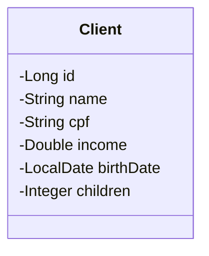

# Desafio: CRUD de Clientes

[](https://www.oracle.com/java/)
[](https://spring.io/projects/spring-boot)
[](https://maven.apache.org/)

## Sobre o Projeto

O projeto **CRUD de Clientes** é uma API REST desenvolvida como solução do desafio do capítulo de **API REST, Camadas, CRUD, Exceções e Validações** da Formação Desenvolvedor Moderno da [DevSuperior](https://devsuperior.com.br), ministrada pelo Prof. Dr. Nélio Alves.

A aplicação consiste em um serviço web back-end para gerenciamento completo do recurso de clientes (`Client`), implementando o padrão de arquitetura em camadas (`Controller`, `Service`, `Repository`, `DTO`), persistência relacional com Spring Data JPA, banco de dados em memória H2, tratamento centralizado de exceções via `@ControllerAdvice` e validações de payloads via Bean Validation.

---

## Modelo de Domínio

Diagrama representativo da entidade `Client`:



### Atributos e Mapeamento Objeto-Relacional
* `id` (`Long`): Identificador único da entidade gerado automaticamente no banco de dados (`GenerationType.IDENTITY`).
* `name` (`String`): Nome completo do cliente.
* `cpf` (`String`): Cadastro de Pessoa Física.
* `income` (`Double`): Renda mensal do cliente.
* `birthDate` (`LocalDate`): Data de nascimento (mapeado pelo JPA na convenção snake_case como coluna `birth_date`).
* `children` (`Integer`): Quantidade de dependentes/filhos.

---

## Regras de Negócio e Validações

1. **Busca paginada (`GET /clients`)**: Listagem paginada e ordenável por parâmetros de requisição (`page`, `size`, `sort`).
2. **Busca por ID (`GET /clients/{id}`)**: Retorna o recurso detalhado caso exista. Caso não exista, retorna código `HTTP 404 Not Found`.
3. **Inserção (`POST /clients`)**: Insere um novo cliente no banco de dados, retornando `HTTP 201 Created` e cabeçalho `Location` com a URL do recurso criado.
4. **Atualização (`PUT /clients/{id}`)**: Atualiza as informações do cliente caso exista. Caso o ID não exista, retorna `HTTP 404 Not Found`.
5. **Deleção (`DELETE /clients/{id}`)**: Remove o cliente pelo ID com retorno `HTTP 204 No Content`. Caso o ID não exista, retorna `HTTP 404 Not Found`.

### Validações de Entrada (Bean Validation)
* **`name`**: Não pode ser vazio ou composto apenas por espaços (`@NotBlank(message = "Campo obrigatório")`).
* **`birthDate`**: Não pode ser uma data posterior à atual (`@PastOrPresent(message = "Data de nascimento não pode ser data futura")`).
* **Tratamento de Validação**: Caso qualquer campo obrigatório viole as restrições nas requisições `POST` ou `PUT`, a API intercepta o erro através de um `@ControllerAdvice` e responde com **`HTTP 422 Unprocessable Entity`**, exibindo a lista detalhada de violações com seus respectivos campos e mensagens.

---

## Endpoints da API

### Tabela Resumo

| Método | Endpoint | Descrição | Status Sucesso | Status Erro Esperados |
| :--- | :--- | :--- | :---: | :---: |
| `GET` | `/clients` | Busca paginada de clientes | `200 OK` | - |
| `GET` | `/clients/{id}` | Busca cliente por identificador | `200 OK` | `404 Not Found` |
| `POST` | `/clients` | Inserção de novo cliente | `201 Created` | `422 Unprocessable Entity` |
| `PUT` | `/clients/{id}` | Atualização de cliente existente | `200 OK` | `404 Not Found`, `422 Unprocessable Entity` |
| `DELETE` | `/clients/{id}` | Remoção de cliente por identificador | `204 No Content` | `404 Not Found` |

---

### Detalhamento dos Endpoints e Payloads

#### 1. Busca Paginada de Clientes
* **Método:** `GET`
* **Rota:** `/clients`
* **Query Params (Exemplo):** `/clients?page=0&size=5&sort=name,asc`
* **Código de Resposta:** `200 OK`

```json
{
  "content": [
    {
      "id": 8,
      "name": "Beatriz Castro Mendes",
      "cpf": "83019284756",
      "income": 6150.0,
      "birthDate": "1996-01-27",
      "children": 2
    },
    {
      "id": 4,
      "name": "Camila Fernandes de Souza",
      "cpf": "40291847582",
      "income": 4600.0,
      "birthDate": "1997-05-19",
      "children": 0
    }
  ],
  "pageable": {
    "pageNumber": 0,
    "pageSize": 5,
    "sort": {
      "empty": false,
      "sorted": true,
      "unsorted": false
    },
    "offset": 0,
    "paged": true,
    "unpaged": false
  },
  "totalPages": 3,
  "totalElements": 15,
  "last": false,
  "size": 5,
  "number": 0,
  "numberOfElements": 2,
  "first": true,
  "empty": false
}
```

---

#### 2. Busca de Cliente por ID
* **Método:** `GET`
* **Rota:** `/clients/{id}`

##### Cenário de Sucesso (`GET /clients/1`) - `200 OK`:
```json
{
  "id": 1,
  "name": "Carlos Eduardo Ribeiro",
  "cpf": "10492837401",
  "income": 3200.0,
  "birthDate": "2001-03-15",
  "children": 0
}
```

##### Cenário de Recurso Inexistente (`GET /clients/999`) - `404 Not Found`:
```json
{
  "timestamp": "2026-09-26T17:00:00Z",
  "status": 404,
  "error": "Recurso não encontrado",
  "message": "Cliente não encontrado",
  "path": "/clients/999"
}
```

---

#### 3. Inserção de Novo Cliente
* **Método:** `POST`
* **Rota:** `/clients`
* **Cabeçalhos:** `Content-Type: application/json`

##### Corpo da Requisição (Válido):
```json
{
  "name": "Maria Silva",
  "cpf": "12345678901",
  "income": 6500.0,
  "birthDate": "1994-07-20",
  "children": 2
}
```

##### Resposta de Sucesso - `201 Created`
* **Cabeçalho:** `Location: http://localhost:8080/clients/16`
```json
{
  "id": 16,
  "name": "Maria Silva",
  "cpf": "12345678901",
  "income": 6500.0,
  "birthDate": "1994-07-20",
  "children": 2
}
```

##### Resposta de Falha de Validação - `422 Unprocessable Entity`:
*(Ao enviar `name` em branco e/ou `birthDate` posterior à data de execução)*
```json
{
  "timestamp": "2026-09-26T17:00:00Z",
  "status": 422,
  "error": "Dados inválidos",
  "message": "Falha na validação do recurso",
  "path": "/clients",
  "errors": [
    {
      "fieldName": "name",
      "message": "Campo obrigatório"
    },
    {
      "fieldName": "birthDate",
      "message": "Data de nascimento não pode ser data futura"
    }
  ]
}
```

---

#### 4. Atualização de Cliente
* **Método:** `PUT`
* **Rota:** `/clients/{id}`
* **Cabeçalhos:** `Content-Type: application/json`

##### Corpo da Requisição:
```json
{
  "name": "Maria Silva Atualizada",
  "cpf": "12345678901",
  "income": 7200.0,
  "birthDate": "1994-07-20",
  "children": 2
}
```

##### Respostas Possíveis:
* **Sucesso:** `200 OK` (retorna o objeto `ClientDTO` atualizado).
* **ID Inexistente:** `404 Not Found` (retorna o schema de erro padrão com a mensagem correspondente).
* **Dados Inválidos:** `422 Unprocessable Entity` (retorna o relatório de violações em `errors`).

---

#### 5. Deleção de Cliente
* **Método:** `DELETE`
* **Rota:** `/clients/{id}`

##### Respostas Possíveis:
* **Sucesso (`DELETE /clients/1`):** `204 No Content` (sem corpo).
* **ID Inexistente (`DELETE /clients/999`):** `404 Not Found`.

---

## Tecnologias e Dependências

* **Java 17**
* **Spring Boot 3.x**
  * `spring-boot-starter-web` (Spring MVC, REST endpoints)
  * `spring-boot-starter-data-jpa` (Hibernate, Spring Data)
  * `spring-boot-starter-validation` (Bean Validation / Hibernate Validator)
* **H2 Database Engine** (persistência em memória)
* **Apache Maven** (gerenciador de build e dependências)

---

## Como Executar o Projeto Localmente

### Pré-requisitos
* Java Development Kit (JDK) 17 ou superior instalado.
* Git instalado e configurado.

### Passos de Instalação e Execução

1. **Clone o repositório:**
```bash
git clone https://github.com/marcosmelodev/crudclientes.git
```

2. **Acesse o diretório raiz do projeto:**
```bash
cd crudclientes
```

3. **Inicie a aplicação utilizando o Maven Wrapper:**
* No Linux / macOS:
```bash
./mvnw spring-boot:run
```
* No Windows PowerShell:
```powershell
.\mvnw spring-boot:run
```

4. **Verifique a inicialização:**
A API estará pronta para receber requisições em: `http://localhost:8080`.

### Acesso ao Console do Banco H2
* **URL:** `http://localhost:8080/h2-console`
* **JDBC URL:** `jdbc:h2:mem:testdb`
* **User Name:** `sa`
* **Password:** *(deixe em branco)*

---

## Autor

Desenvolvido por **Marcos Melo**  
GitHub: [@marcosmelodev](https://github.com/marcosmelodev)